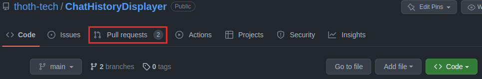
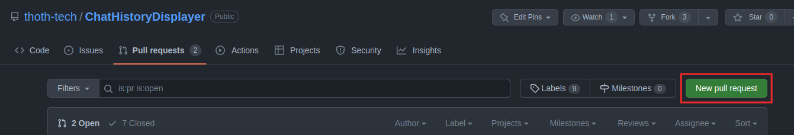
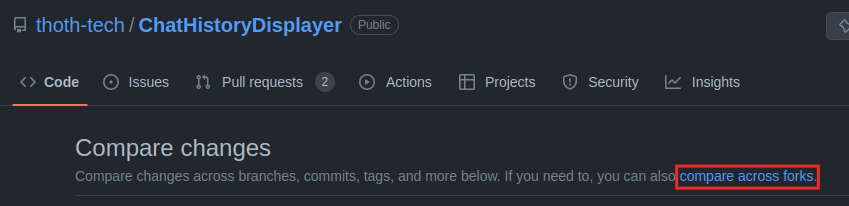
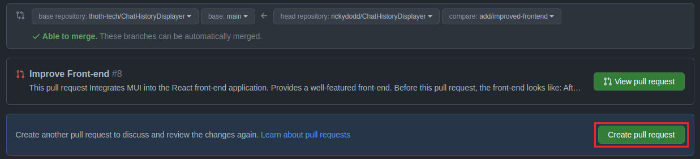

# CONTRIBUTING.md

## Contents

----

- [CONTRIBUTING.md](#contributingmd)
  - [Contents](#contents)
  - [Prerequisites](#prerequisites)
  - [Getting Development Ready](#getting-development-ready)
  - [Branching Strategy](#branching-strategy)
    - [Setting Up a Branch](#setting-up-a-branch)
    - [Branch Naming Scheme](#branch-naming-scheme)
  - [Commit Strategy](#commit-strategy)
    - [Form of a Commit](#form-of-a-commit)
    - [Present Tense and Imperative Mood](#present-tense-and-imperative-mood)
    - [Prefixes](#prefixes)
  - [Running Development Instance](#running-development-instance)
  - [Attaching Bash Terminal](#attaching-bash-terminal)
  - [Running API Tests](#running-api-tests)
  - [Creating a Pull Request](#creating-a-pull-request)

## Prerequisites

----

- A terminal capable of executing `sh` scripts (if you are on Windows, then WSL2, MSYS2, or
  similar).
- Docker (if you are on Windows and using WSL2, then Docker Desktop will suffice).
- Configure git.

## Getting Development Ready

----

The [thoth-tech/ChatHistoryDisplayer](https://github.com/thoth-tech/ChatHistoryDisplayer) uses a [forking workflow](https://www.atlassian.com/git/tutorials/comparing-workflows/forking-workflow).

1. Fork [thoth-tech/ChatHistoryDisplayer](https://github.com/thoth-tech/ChatHistoryDisplayer).

2. Clone your fork of the repository. Replace `YOUR_GITHUB_USERNAME` in the following bash command with your GitHub username.

    ```bash
    git clone https://github.com/YOUR_GITHUB_USERNAME/ChatHistoryDisplayer.git
    ```

3. Navigate into the `ChatHistoryDisplayer` directory with `cd ChatHistoryDisplayer`.

4. Set [thoth-tech/ChatHistoryDisplayer](https://github.com/thoth-tech/ChatHistoryDisplayer) as the upstream.

  ```bash
  git remote add upstream https://github.com/thoth-tech/ChatHistoryDisplayer.git
  ```

You can now pull changes from the main branch of [thoth-tech/ChatHistoryDisplayer](https://github.com/thoth-tech/ChatHistoryDisplayer) with `git pull upstream`.

## Branching Strategy

----

### Setting Up a Branch

When making a change, you should first create a well-named branch, make the change on this branch, and then pull request the changes on this branch into [thoth-tech/ChatHistoryDisplayer](https://github.com/thoth-tech/ChatHistoryDisplayer).

A local branch can be created and checked out with, for example,

```bash
git checkout -b BRANCH_NAME
```

where `BRANCH_NAME` is replaced with the desired branch name. It is advised you follow the naming scheme put forward by the branching strategy.

After creating a local branch, you can push the branch to your remote fork of the repository using

```bash
git push --set-upstream origin BRANCH_NAME
```

where `BRANCH_NAME` is replaced with the name of the branch you created locally.

After that, it is possible to push any local changes within the local branch to the remote branch on your fork of the repository using `git push`.

### Branch Naming Scheme

It is advised that all branches begin with a prefix followed by a name that explains, at a high-level, what the branch intends to do. `prefix/concise-name`, is the form it must take.

| Prefix | Example | Explanation |
|--------|---------|-------------|
|`add`    | `add/authorisation-tokens` | Use when adding something non-functional. |
|`feature`   | `feature/delete-user-dir` | Use when adding something functional. |
| `refactor` | `refactor/commit-function` | Use when changing the form of something without impacting functionality. |
|`fix`    | `fix/rack-config` | Use when fixing something, such as a bug. |

## Commit Strategy

----

### Form of a Commit

Ensure your git global text editor is one you are comfortable with. After that, commits should omit the `-m` flag so that it opens up your favourite text editor. That is, instead of `git commit -m "A_MESSAGE`, you are advised to do `git commit` and use the text editor.

Commits must take the form:

```text
prefix: SHORT MESSAGE

LONGER MESSAGE
```

An empty line is recommended between the first and third lines. Replace `prefix` with a specific, relevant prefix; `SHORT MESSAGE` with a short message in present tense with an imperative mood; and `LONGER MESSAGE` with a longer message about the commit.

### Present Tense and Imperative Mood

Commit messages should be in present tense with an imperative mood. Instead of `fixes a bug`, `fix a bug` is more appropriate. A heuristic that can be employed is to think of the sentence `This commit will ...`, complete the sentence in your mind, and use everything after `This commit will ...` to form the short message of the commit.

Example:

`This commit will fix a bug in rack's config` -> `fix: bug in rack's config`.

### Prefixes

| Prefix | Explanation | Example |
|--------|-------------|---------|
| add | Use when adding something non-functionality related | `add: rubocop` |
| feat | Use when adding something functionality related | `add: get end-point` |
| refac | Use when changing the form of something without changing functionality | `refac: create user directories` |
| fix | Use when fixing something | `fix: user dir not deleting` |

## Running Development Instance

----

In the `chathistorydisplayer` directory, execute

```bash
docker compose up
```

After it is done setting up, `chathistorydisplayer-web` will be accessible from [http://localhost:3000/](http://localhost:3000/).

## Attaching Bash Terminal

----

This is most useful for attaching a bash terminal to the `chathistorydisplayer-api`, as you can use executable Ruby gems with the terminal attached to the container. For example, when the terminal is attached to the running container for the `chathistorydisplayer-api`, you can execute `bundle exec rubocop` to execute the static text analyser and linter `rubocop`.

- To attach a bash terminal to `chathistorydisplayer-api`, execute

  ```bash
  docker exec -it chathistorydisplayer-api-1 /bin/bash
  ```

- To attach a bash terminal to `chathistorydisplayer-web`, execute

  ```bash
  docker exec -it chathistorydisplayer-web-1 /bin/bash
  ```

## Running API Tests

----

With the [bash terminal attached](#attaching-bash-terminal) to the API, you can execute the tests on the API end-points with the following command:

```bash
rspec spec/api_specs/
```

## Creating a Pull Request

----

- Visit [thoth-tech/ChatHistoryDisplayer](https://github.com/thoth-tech/ChatHistoryDisplayer).

- Click on "Pull requests" in the `thoth-tech/ChatHistoryDisplayer` repository navigation bar.


- Click on "New pull request".


- Click on "compare across forks".


- Set what is to be pulled to your fork of the repository and the branch you want to pull into `thoth-tech/ChatHistoryDisplayer`'s main branch.


- Click on "Create pull request".


- Fill out the finer details of what your pull request does and publish it.

  - Remark on what your commits do. You don't have to remark on each commit, but just give a general idea on what they do.

  - Remark on whether you followed the [commit strategy](#commit-strategy).

  - Remark on whether your code has been self-reviewed.

  - Remark on whether your code has been reviewed by a peer.
