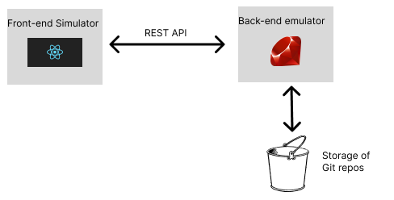

# Chat History Displayer

## Shows the chat history and version controlled file submission.
### Supported by the Task View and Submission redesign team

We will be utilising a ruby [library](https://github.com/ruby-git/ruby-git) to interface with git to display what files are new and what are already submitted for any given submission. 

We will create a working Proof of Concept (POC) in this repo before working on intergrating with the doubfire backend. 

## Backend Rest API [DESIGN.md](./DESIGN.md)

A simple overview of the proposed solution




# Getting the Frontend running

Read the [documenation](./frontEndSimulator/README.md) on dependencies and how to start the application

The front end serves as a convinient way to see the responses served by the backend and is meant to simulate what the Ontrack Frontend will be doing. Alternatively you can load `Emulator.postman_collection.json` into [Postman](https://www.postman.com/) and interface with the API directly.

# Getting the backend emulator running

The emulator is a simple HTTP server running on [Sinatra](https://sinatrarb.com/), a Ruby server library. 

**Requirements**

Make sure you have ruby installed on your machine. Then you'll want to install the following tools to run the emulator.

```
sudo gem install sinatra
sudo gem install rerun
sudo gem install <missing_package_name_here>
```

To run the server, simply enter `rerun 'ruby main.rb'` into the terminal in the same directory as the emulator. 

Navigate to `localhost:4567` on a web brower to see the server running.

You'll want to install a tool like [Postman](https://www.postman.com/) to invoke all of the methods in the emulator or use command line tools like [curl](https://curl.se/)

A postman workspace json is included if you wish to use that. Simply open the file using Postman 

### A video demo

This [video](./demoVid.mp4) demo demonstrates how the 2 systems interact with each other

[Link](https://drive.google.com/file/d/1RmW_RmXUaENfiCkVrQTSJVl8b9A0joIn/view?usp=sharing) to it on Google Drive